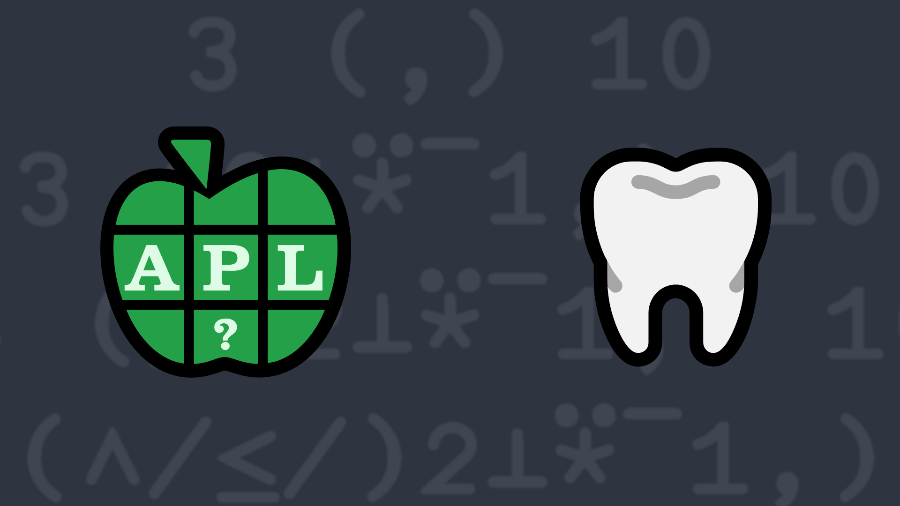

# 7: See You in a Bit
A common technique for encoding a set of on/off states is to use a value of 2<sup><em>n</em></sup> for the state in position <em>n</em> (origin 0), 1 if the state is "on" or 0 for "off" and then add the values. Dyalog APL's [component file permission codes](https://help.dyalog.com/17.1/#Language/APL%20Component%20Files/Component%20Files.htm#File_Access_Control) are an example of this. For example, if you wanted to grant permissions for read (access code 1), append (access code 8) and rename (access code 128) then the resulting code would be 137 because that's 1 + 8 + 128.

Write a function that, given a non-negative right argument which is an integer scalar representing the encoded state and a left argument which is an integer scalar representing the encoded state settings that you want to query, returns 1 if all of the codes in the left argument are found in the right argument (0 otherwise).

💡 Hint: The Decode function [`X⊥Y`](https://help.dyalog.com/latest/#Language/Primitive%20Functions/Decode.htm) and the derived Inverse operator [`⍣¯1`](https://help.dyalog.com/latest/#Language/Primitive%20Operators/Power%20Operator.htm) could be helpful for decoding the states.

### Examples
```APL
      2 (your_function) 7   ⍝ is 2 in 7 (1+2+4)?
1

      4 (your_function) 11   ⍝ is 4 in 11 (1+2+8)?
0

      3 (your_function) 11   ⍝ is 3 (1+2) in 11 (1+2+8)?
1

      4 (your_function) 0   ⍝ is 4 in 0?
0
```
<div class="pdiv">
  <code>your_function ← </code><input id="p_Input" autocomplete="off" spellcheck="false">
  <button onclick="alert$.next`Testing…`;submitSolution`p`" class="md-button">&#x2714; Test</button>
</div>
<blockquote id="p_Output"></blockquote>
??? info "Solutions"
    <div onclick="play(this)">
        
        
    </div>
    [Chat transcript](https://chat.stackexchange.com/transcript/52405?m=64028252#64028252) ∙ [Code on GitHub](https://github.com/abrudz/apl_quest/tree/main/2020/7.apl)
<script>
    testCases={"a":[["2","7"],["4","11"],["3","11"],["847","847"],["447","847"],["661","847"],["?256","?256"]],"b":[["42","0"],["0","42"],["0","0"],["959","847"]],"f":"{∧/≤/2⊥⍣¯1⊢⍺⍵}","p":","}
    play=e=>e.outerHTML=`<iframe src="https://www.youtube.com/embed/xXweDCXIVSk&list=PLYKQVqyrAEj9wDIUyLDGtDAFTKY38BUMN&autoplay=1" title="Seems a Bit Odd To Me (APL Quest 2013-1)" frameborder="0" allow="accelerometer; autoplay; clipboard-write; encrypted-media; gyroscope; picture-in-picture; web-share" referrerpolicy="strict-origin-when-cross-origin" allowfullscreen="" width="1920" height="1080"></iframe>`
    p_Input.focus()
</script>
