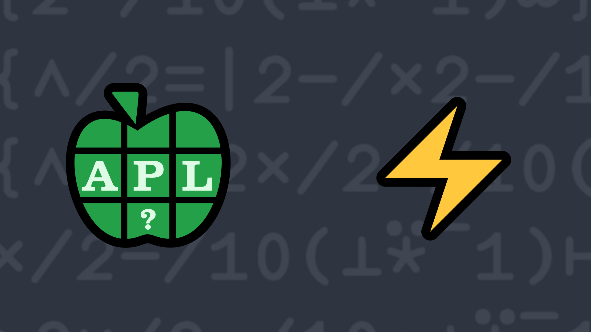

# <span class=s>2020-</span>8: Zigzag Numbers
A zigzag number is an integer in which the difference in magnitude of each pair of consecutive digits alternates from positive to negative or negative to positive.

Write a function that takes a single integer greater than or equal to 100 and less than 10<sup>15</sup> as its right argument and returns a 1 if the integer is a zigzag number, 0 otherwise. 

💡 Hint: Your solution might make use of <em>N-wise Reduction</em> [`X f/ Y`](https://help.dyalog.com/latest/#Language/Primitive%20Operators/Reduce%20N%20Wise.htm).

### Examples
```APL
      (your_function) 123 
0

      (your_function) 132
1

      (your_function) 31115
0

      (your_function) 3141514131415
1
```
<div class="pdiv">
  <code onclick="p_Input.focus()">your_function ← </code><input id="p_Input" autocomplete="off" spellcheck="false" oninput="this.parentElement.querySelector`button`.disabled=false;localStorage.setItem(window.location.pathname,this.value)" onkeypress="subm(event)">
  <button onclick="alert$.next`Testing…`;submitSolution`p`" class="md-button md-button--primary">&#x2714; Test</button>
</div>
<blockquote id="p_Output"></blockquote>
## Solutions
<div onclick="play(this)" title="Video on YouTube" class="yt">

<time>10:57</time>

</div>
<a href="https://chat.stackexchange.com/transcript/52405?m=64081060#64081060" target="_blank" class="md-button md-button--primary">Chat transcript</a>
<a href="https://github.com/abrudz/apl_quest/tree/main/2020/8.apl" target="_blank" class="md-button md-button--primary right">Code on GitHub</a>

<script>
    testCases={"a":["123","132","31115","3115","3315","3155","3141514131415","3141514131454"],"b":["11111111"],"f":"∧/0>2×/2-/10⊥⍣¯1⊢","p":","}
    p_Input.value=localStorage.getItem(window.location.pathname)
    play=e=>e.outerHTML=`<iframe src="https://www.youtube.com/embed/Q-8LAhe79zM?list=PLYKQVqyrAEj9wDIUyLDGtDAFTKY38BUMN&autoplay=1" title="<span class=s>2020-</span>8: Zigzag Numbers (APL Quest 2020-8)" frameborder="0" allow="accelerometer; autoplay; clipboard-write; encrypted-media; gyroscope; picture-in-picture; web-share" referrerpolicy="strict-origin-when-cross-origin" allowfullscreen></iframe>`
</script>
