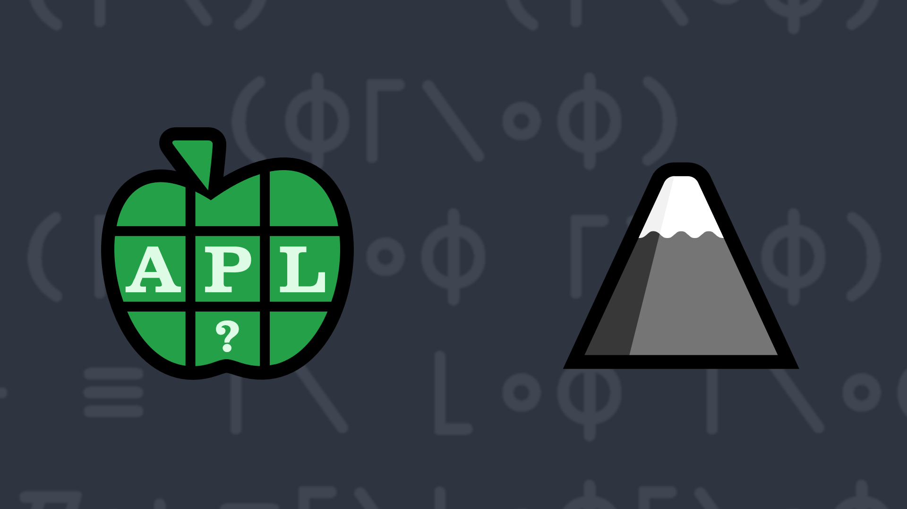

# <span class=s>2020-</span>9: Rise and Fall
<!-- Write a function that, given a right argument which is an integer scalar or vector, returns a 1 if the values of the right argument conform to the given pattern (0 otherwise) -->
Write a function that, given a right argument which is an integer scalar or vector, returns a 1 if the values of the right argument conform to the following pattern (0 otherwise):

- The elements increase or stay the same until the "apex" (highest value) is reached
- After the apex, any remaining values decrease or remain the same


💡 Hint: The *Reverse* function [`⌽Y`](https://help.dyalog.com/latest/#Language/Primitive%20Functions/Reverse.htm) and the *Maximum* function [`X⌈Y`](https://help.dyalog.com/latest/#Language/Primitive%20Functions/Maximum.htm) combined with *N-wise Reduction* [`X f/ Y`](https://help.dyalog.com/latest/#Language/Primitive%20Operators/Reduce%20N%20Wise.htm) or *Scan* [`f\ Y`](https://help.dyalog.com/latest/#Language/Primitive%20Operators/Scan.htm) can help with solving this problem.

### Examples
```APL
      (your_function) 1 3 3 4 5 2 1
1

      (your_function) 42
1

      (your_function) 1 3 2 4
0

      (your_function) 23 23 23 
1

      (your_function) ⍬  ⍝ empty vector
1
```
<div class="pdiv">
  <code onclick="p_Input.focus()">your_function ← </code><input id="p_Input" autocomplete="off" spellcheck="false" oninput="this.parentElement.querySelector`button`.disabled=false;localStorage.setItem(window.location.pathname,this.value)" onkeypress="subm(event)">
  <button onclick="alert$.next`Testing…`;submitSolution`p`" class="md-button md-button--primary">&#x2714; Test</button>
</div>
<blockquote id="p_Output"></blockquote>
## Solutions
<div onclick="play(this)" title="Video on YouTube" class="yt">


</div>
<a href="https://chat.stackexchange.com/transcript/52405?m=64125164#64125164" target="_blank" class="md-button md-button--primary">Chat transcript</a>
<a href="https://github.com/dyalog/apl.quest/tree/main/2020/9.apl" target="_blank" class="md-button md-button--primary right">Code on GitHub</a>

<script>
    testCases={"a":["1 3 2 4","23 23 23","1 3 3 4 5 2 1","4?10"],"b":["42","10 20","1 2 3","-1 2 3","0","⍬"],"f":"(⊢≡⌈⍀⌊∘⌽⌈⍀∘⌽)","p":","}
    p_Input.value=localStorage.getItem(window.location.pathname)
    play=e=>e.outerHTML=`<iframe src="https://www.youtube.com/embed/qypqissqN-c?list=PLYKQVqyrAEj9wDIUyLDGtDAFTKY38BUMN&autoplay=1" title="<span class=s>2020-</span>9: Rise and Fall (APL Quest 2020-9)" frameborder="0" allow="accelerometer; autoplay; clipboard-write; encrypted-media; gyroscope; picture-in-picture; web-share" referrerpolicy="strict-origin-when-cross-origin" allowfullscreen></iframe>`
</script>
