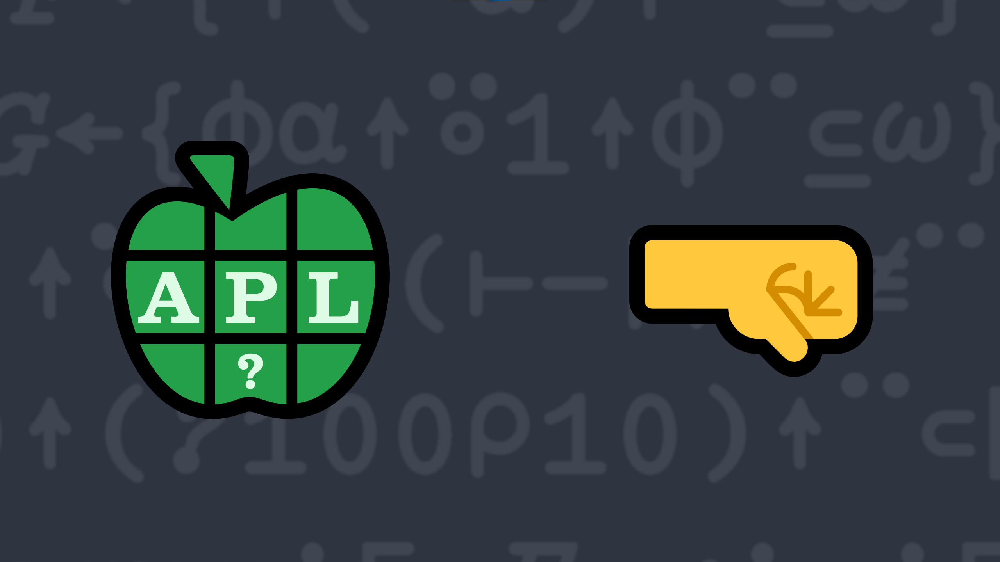

# <span class=s>2021-</span>10: On the Right Side

<p>Write a function that:</p>
- has a right argument <span class="language-APL">T</span> that is a character scalar, vector or a vector of character vectors/scalars.
- has a left argument <span class="language-APL">W</span> that is a positive integer specifying the width of the result.
- returns a right-aligned character array <span class="language-APL">R</span> of shape <span class="language-APL">((2=|≡T)/≢T),W</span> meaning <span class="language-APL">R</span> is one of the following:
    - a <span class="language-APL">W</span>-wide vector if <span class="language-APL">T</span> is a simple vector or scalar.
    - a <span class="language-APL">W</span>-wide matrix with the same number rows as elements of <span class="language-APL">T</span> if <span class="language-APL">T</span> is a vector of vectors/scalars.
- if an element of <span class="language-APL">T</span> has length greater than <span class="language-APL">W</span>, truncate it after <span class="language-APL">W</span> characters.

💡 Hint: Your solution might make use of <em>take</em>
      <a href="https://help.dyalog.com/latest/#Language/Primitive%20Functions/Take.htm" class="language-APL" target="_blank">X ↑ Y</a>.

### Examples

<p>In these examples, <span class="language-APL">⍴⎕←</span> is inserted to display first the result and then its shape.</p>

```APL

      ⍴⎕←6 (your_function) '⍒'
     ⍒
6

      ⍴⎕←8 (your_function) 'K' 'E' 'Iverson'
       K
       E
 Iverson
3 8

      ⍴⎕←10 (your_function) 'Parade' 
    Parade
10

      ⍴⎕←8 (your_function) 'Longer Phrase' 'APL' 'Parade' 
r Phrase
     APL
  Parade
3 8

      starsForSpaces←'*'@(=∘' ')
      starsForSpaces 6 (your_function) '⍒'
*****⍒
  
```
 
<div class="pdiv">
  <code onclick="p_Input.focus()">your_function ← </code><input id="p_Input" autocomplete="off" spellcheck="false" oninput="this.parentElement.querySelector`button`.disabled=false" onkeypress="subm(event)">
  <button onclick="alert$.next`Testing…`;submitSolution`p`" class="md-button md-button--primary">&#x2714; Test</button>
</div>
<blockquote id="p_Output"></blockquote>
## Solutions
<div onclick="play(this)" title="Video on YouTube" class="yt">


</div>
<a href="https://chat.stackexchange.com/transcript/52405?m=64604513#64604513" target="_blank" class="md-button md-button--primary">Chat transcript</a>
<a href="https://github.com/abrudz/apl_quest/tree/main/2021/10.apl" target="_blank" class="md-button md-button--primary right">Code on GitHub</a>

<script>
    testCases={"a":[["6","'⍒'"],["8","'K' 'E' 'Iverson'"],["10","'Parade'"],["8","'Longer Phrase' 'APL' 'Parade'"],["2+?5","⎕A[10?26]"]],"b":[["1","'a'"],["0","'abc'"],["0","'abc' 'd'"],["1","' '"],["0","'ab '"],["0","'a  ' 'd'"],["0","0⍴⊂''"],["0","' '"],["5","''"],["5","'' '' ''"],["5","0⍴⊂''"],["5","' '"]],"f":"{⌽⍺↑⍤1↑⌽¨⊆⍵}","p":"⊢"}
    play=e=>e.outerHTML=`<iframe src="https://www.youtube.com/embed/tClkG4ybunI?list=PLYKQVqyrAEj9wDIUyLDGtDAFTKY38BUMN&autoplay=1" title="<span class=s>2021-</span>10: On the Right Side (APL Quest 2021-10)" frameborder="0" allow="accelerometer; autoplay; clipboard-write; encrypted-media; gyroscope; picture-in-picture; web-share" referrerpolicy="strict-origin-when-cross-origin" allowfullscreen></iframe>`
</script>
