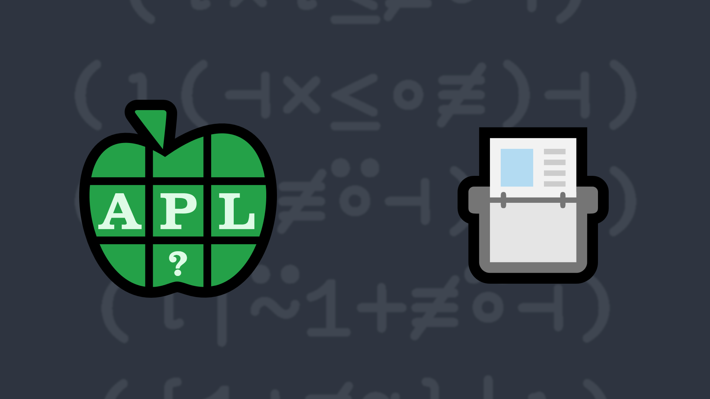

# <span class=s>2021-</span>2: Index-Of Modified
<!-- Write a function that behaves like the APL <em>index-of</em> function `R←X⍳Y` except that it returns `0` instead of `1+≢X` for elements of `Y` not found in `X`.
 -->
Write a function that behaves like the APL <em>index-of</em> function <a href="https://help.dyalog.com/latest/#Language/Primitive%20Functions/Index%20Of.htm" class="language-APL" target="_blank">R←X⍳Y</a> except that it returns <code class="language-APL">0</code> instead of <code class="language-APL">1+≢X</code> for elements of <code class="language-APL">Y</code> not found in <code class="language-APL">X</code>.

### Examples:
```APL
      'DYALOG' (your_function) 'APL'
3 0 4
      
      (5 5⍴⎕A) (your_function) ↑'UVWXY' 'FGHIJ' 'XYZZY'
5 2 0
```
<div class="pdiv">
  <code onclick="p_Input.focus()">your_function ← </code><input id="p_Input" autocomplete="off" spellcheck="false" oninput="this.parentElement.querySelector`button`.disabled=false;localStorage.setItem(window.location.pathname,this.value)" onkeypress="subm(event)">
  <button onclick="alert$.next`Testing…`;submitSolution`p`" class="md-button md-button--primary">&#x2714; Test</button>
</div>
<blockquote id="p_Output"></blockquote>
## Solutions
<div onclick="play(this)" title="Video on YouTube" class="yt">

<time>6:36</time>

</div>
<a href="https://chat.stackexchange.com/transcript/52405?m=64262014#64262014" target="_blank" class="md-button md-button--primary">Chat transcript</a>
<a href="https://github.com/abrudz/apl_quest/tree/main/2021/2.apl" target="_blank" class="md-button md-button--primary right">Code on GitHub</a>

<script>
    testCases={"a":[["'DYALOG'","'APL'"],["5 5⍴⎕A","↑'UVWXY' 'FGHIJ' 'XYZZY'"],["⎕D[?5⍴9]","('9',⎕D)[?5⍴10]"]],"b":[["4 3⍴⎕A","'GHI'"],["4 3⍴⎕A","1 3⍴'GHI'"],["4 3⍴⎕A","2 2 3⍴'GHI'"],["4 3⍴⎕A","'GHX'"],["4 3⍴⎕A","1 3⍴'GHX'"],["4 3⍴⎕A","2 2 3⍴'GHX'"],["⍬","?42"],["⍬","⍪3 1 4"],["2 7 1 8","⍬"],["⍬","⍬"]],"f":"⍳|⍨1+(≢⊣)","p":"⊢"}
    p_Input.value=localStorage.getItem(window.location.pathname)
    play=e=>e.outerHTML=`<iframe src="https://www.youtube.com/embed/r5VQ9wSBVTg?list=PLYKQVqyrAEj9wDIUyLDGtDAFTKY38BUMN&autoplay=1" title="<span class=s>2021-</span>2: Index-Of Modified (APL Quest 2021-2)" frameborder="0" allow="accelerometer; autoplay; clipboard-write; encrypted-media; gyroscope; picture-in-picture; web-share" referrerpolicy="strict-origin-when-cross-origin" allowfullscreen></iframe>`
</script>
