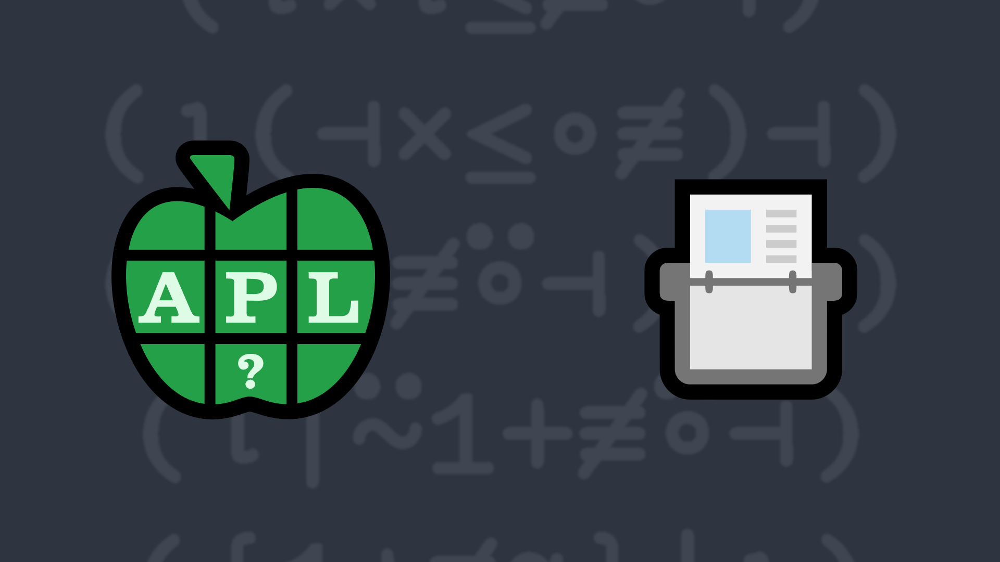

# 2: Index-Of Modified
Write a function that behaves like the APL <em>index-of</em> function <a href="https://help.dyalog.com/latest/#Language/Primitive%20Functions/Index%20Of.htm" class="language-APL" target="_blank">R←X⍳Y</a> except that it returns <span class="language-APL">0</span> instead of <span class="language-APL">1+≢X</span> for elements of <span class="language-APL">Y</span> not found in <span class="language-APL">X</span>.

### Examples
```APL
      'DYALOG' (your_function) 'APL'
3 0 4
      
      (5 5⍴⎕A) (your_function) ↑'UVWXY' 'FGHIJ' 'XYZZY'
5 2 0
```
<div class="pdiv">
  <code>your_function ← </code><input id="p_Input" autocomplete="off" spellcheck="false">
  <button onclick="alert$.next`Testing…`;submitSolution`p`" class="md-button">&#x2714; Test</button>
</div>
<blockquote id="p_Output"></blockquote>
??? info "Solutions"
    <div onclick="play(this)">
        
        
    </div>

    [Chat transcript](https://chat.stackexchange.com/transcript/52405?m=64262014#64262014)&emsp;∙&emsp;[Code on GitHub](https://github.com/abrudz/apl_quest/tree/main/2021/2.apl)
<script>
    testCases={"a":[["'DYALOG'","'APL'"],["5 5⍴⎕A","↑'UVWXY' 'FGHIJ' 'XYZZY'"],["⎕D[?5⍴9]","('9',⎕D)[?5⍴10]"]],"b":[["4 3⍴⎕A","'GHI'"],["4 3⍴⎕A","1 3⍴'GHI'"],["4 3⍴⎕A","2 2 3⍴'GHI'"],["4 3⍴⎕A","'GHX'"],["4 3⍴⎕A","1 3⍴'GHX'"],["4 3⍴⎕A","2 2 3⍴'GHX'"],["⍬","?42"],["⍬","⍪3 1 4"],["2 7 1 8","⍬"],["⍬","⍬"]],"f":"⍳|⍨1+(≢⊣)","p":"⊢"}
    play=e=>e.outerHTML=`<iframe src="https://www.youtube.com/embed/r5VQ9wSBVTg" title="2: Index-Of Modified (APL Quest 2021-2)" frameborder="0" allow="accelerometer; autoplay; clipboard-write; encrypted-media; gyroscope; picture-in-picture; web-share" referrerpolicy="strict-origin-when-cross-origin" allowfullscreen></iframe>`
    p_Input.focus()
</script>
