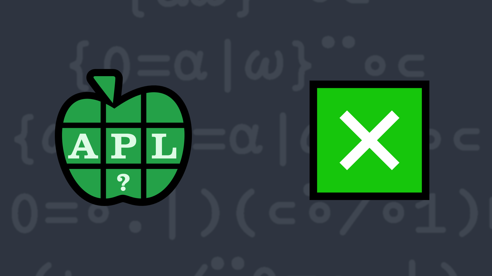

# <span class=s>2021-</span>3: Multiplicity
<!-- Write a function that finds which elements of <code class="language-APL">Y</code> are multiples of each element of <code class="language-APL">X</code> and returns them as a vector (in the order of <code class="language-APL">X</code>) of vectors (in the order of <code class="language-APL">Y</code>). -->
Write a function that:
- has a right argument <code class="language-APL">Y</code> which is an integer vector or scalar
- has a left argument <code class="language-APL">X</code> which is also an integer vector or scalar
- finds which elements of <code class="language-APL">Y</code> are multiples of each element of <code class="language-APL">X</code> and returns them as a vector (in the order of <code class="language-APL">X</code>) of vectors (in the order of <code class="language-APL">Y</code>).

💡 Hint: The <em>residue</em> function <a href="http://help.dyalog.com/latest/#Language/Primitive%20Functions/Residue.htm" class="language-APL" target="_blank">X|Y</a> and <em>outer product</em> operator <a href="http://help.dyalog.com/latest/#Language/Primitive%20Operators/Outer%20Product.htm" class="language-APL" target="_blank">X∘.fY</a> might be useful for this problem.

### Examples:
```APL
      ⎕←Y←20?20 ⍝ your example may be different
5 7 8 1 12 10 20 16 11 4 2 15 3 18 14 19 13 9 17 6
      
      2 4 7 3 9 (your_function) Y ⍝ using ]Box on
┌─────────────────────────┬────────────┬────┬──────────────┬────┐
│8 12 10 20 16 4 2 18 14 6│8 12 20 16 4│7 14│12 15 3 18 9 6│18 9│
└─────────────────────────┴────────────┴────┴──────────────┴────┘
      
      3 (your_function) ⍳10
┌─────┐
│3 6 9│
└─────┘
      
      6 7 (your_function) 42
┌──┬──┐
│42│42│
└──┴──┘
      
      2 3 5 (your_function) ⍬ ⍝ returns a vector of 3 empty vectors
┌┬┬┐
││││
└┴┴┘

      ⍬ (your_function) ⍳10 ⍝ returns an empty vector
```
<div class="pdiv">
  <code onclick="p_Input.focus()">your_function ← </code><input id="p_Input" autocomplete="off" spellcheck="false" oninput="this.parentElement.querySelector`button`.disabled=false;localStorage.setItem(window.location.pathname,this.value)" onkeypress="subm(event)">
  <button onclick="alert$.next`Testing…`;submitSolution`p`" class="md-button md-button--primary">&#x2714; Test</button>
</div>
<p id="p_Output"></p>
## Solutions
<div onclick="play(this)" title="Video on YouTube" class="yt">

<time>10:00</time>

</div>
<a href="https://chat.stackexchange.com/transcript/52405?m=64315806#64315806" target="_blank" class="md-button md-button--primary">Chat transcript</a>
<a href="https://github.com/abrudz/apl_quest/tree/main/2021/3.apl" target="_blank" class="md-button md-button--primary right">Code on GitHub</a>

<script>
    testCases={"a":[["2 4 7 3 9","5 7 8 1 12 10 20 16 11 4 2 15 3 18 14 19 13 9 17 6"],["3","⍳10"],["6 7","42"],["2 3 5","⍬"],["⍬","⍳10"],["20?100","20?100"]],"b":[["⍬","⍬"],["6","42"],["6","7"],["2 3 4","11"],["2 3 4","12"],["0","0"],["0","10"],["10","0"],["4 0","0 5"],["4 0","10 5"],["4 10","5 0"],["1-20?100","1-20?100"]],"f":"⊢{⊂⍺/⍵}⍤1⍨0=(,⊣)∘.|(,⊢)","p":"⍬,⊢"}
    p_Input.value=localStorage.getItem(window.location.pathname)
    play=e=>e.outerHTML=`<iframe class="md-header--shadow" src="https://www.youtube.com/embed/h9xqYCxiMJo?list=PLYKQVqyrAEj9wDIUyLDGtDAFTKY38BUMN&autoplay=1" title="<span class=s>2021-</span>3: Multiplicity (APL Quest 2021-3)" frameborder="0" allow="accelerometer; autoplay; clipboard-write; encrypted-media; gyroscope; picture-in-picture; web-share" referrerpolicy="strict-origin-when-cross-origin" allowfullscreen></iframe>`
</script>
