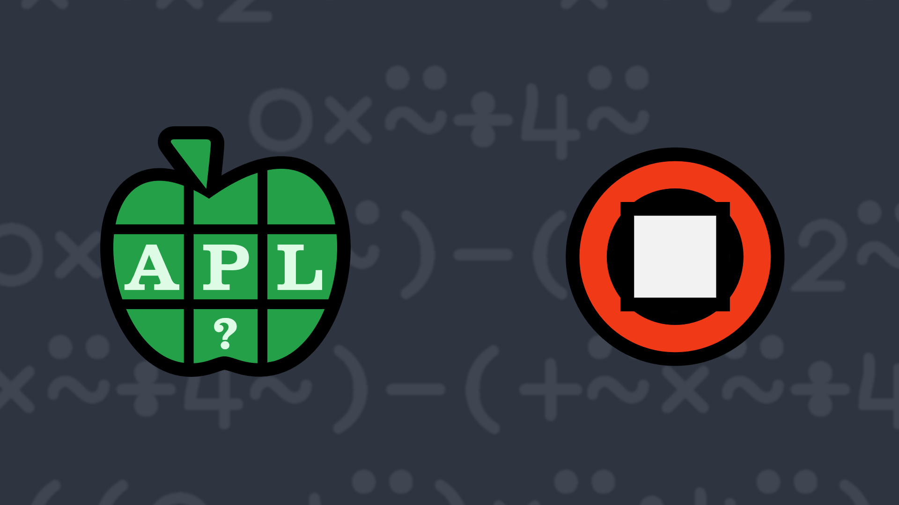

# <span class=s>2021-</span>4: Square Peg, Round Hole
<!-- Write a function which returns a numeric array of the same shape as the right argument representing the difference between the areas of the circles and the areas of the largest squares that can be inscribed within each circle. -->
Write a function that:

- takes a right argument which is an array of positive numbers representing circle diameters
- returns a numeric array of the same shape as the right argument representing the difference between the areas of the circles and the areas of the largest squares that can be inscribed within each circle

💡 Hint: The <em>pi times</em> function <a href="https://help.dyalog.com/latest/#Language/Primitive%20Functions/Pi%20Times.htm" class="language-APL" target="_blank">○Y</a> could be helpful.

### Examples

```APL
      (your_function) 2×⍳5
1.141592654 4.566370614 10.27433388 18.26548246 28.53981634

      (your_function) (2*.5)×3 3 ⍴⍳9
 0.5707963268  2.283185307  5.137166941
 9.132741229  14.26990817  20.54866776 
27.96902001   36.53096491  46.23450247 
```
<div class="pdiv">
  <code onclick="p_Input.focus()">your_function ← </code><input id="p_Input" autocomplete="off" spellcheck="false" oninput="this.parentElement.querySelector`button`.disabled=false;localStorage.setItem(window.location.pathname,this.value)" onkeypress="subm(event)">
  <button onclick="alert$.next`Testing…`;submitSolution`p`" class="md-button md-button--primary">&#x2714; Test</button>
</div>
<blockquote id="p_Output"></blockquote>
## Solutions
<div onclick="play(this)" title="Video on YouTube" class="yt">


</div>
<a href="https://chat.stackexchange.com/transcript/52405?m=64360617#64360617" target="_blank" class="md-button md-button--primary">Chat transcript</a>
<a href="https://github.com/abrudz/apl_quest/tree/main/2021/4.apl" target="_blank" class="md-button md-button--primary right">Code on GitHub</a>

<script>
    testCases={"a":["1.141592654 4.566370614 10.27433388 18.26548246 28.53981634","(2*.5)×3 3⍴⍳9","?((1+?2)⍴1+?2)⍴10"],"b":["10×?3⍴0","4","0","⍬","0 0⍴0","0 3⍴0","3 0⍴0","5 0 1⍴0"],"f":" {(2*⍨⍵÷2)ׯ2+○1}","p":"⊢"}
    p_Input.value=localStorage.getItem(window.location.pathname)
    play=e=>e.outerHTML=`<iframe src="https://www.youtube.com/embed/h0RS-rEV3BM?list=PLYKQVqyrAEj9wDIUyLDGtDAFTKY38BUMN&autoplay=1" title="<span class=s>2021-</span>4: Square Peg, Round Hole (APL Quest 2021-4)" frameborder="0" allow="accelerometer; autoplay; clipboard-write; encrypted-media; gyroscope; picture-in-picture; web-share" referrerpolicy="strict-origin-when-cross-origin" allowfullscreen></iframe>`
</script>
