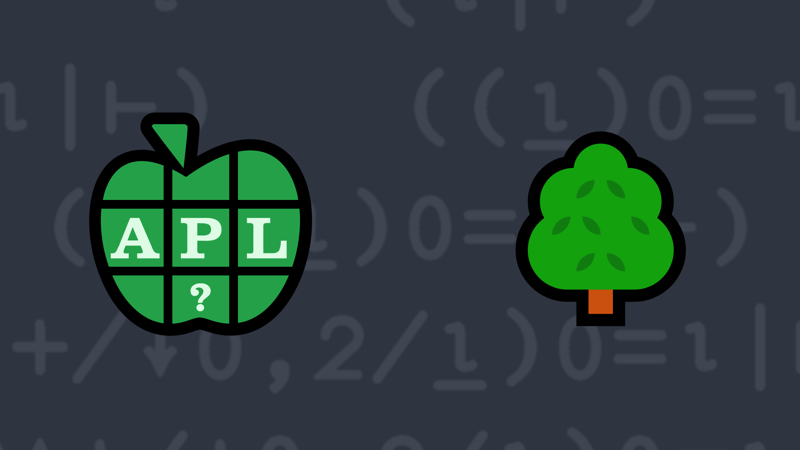

# <span class=s>2021-</span>5: Rect-ify
<!-- Write a function that has a right argument which is a positive integer less than or equal to 1,000,000 and returns a 2-element integer vector representing the rows and columns of the most square rectangle such that the number product of the number of rows and columns equals the argument. -->
Suppose you have a number of trees that you want to plant in a rectangular pattern with complete rows and columns, meaning all rows have the same number of trees. You also want that rectangular pattern to be as "square" as possible, meaning there is a minimal difference between the number of rows and columns in the pattern.

Write a function that:
- has a right argument <span class="language-APL"><b>N</b></span> which is a positive integer less than or equal to 1,000,000.
- returns a 2-element integer vector <code class="language-APL">R</code> representing the rows and columns of the rectangle such that:
    - <code class="language-APL">N=×/R</code> meaning <code class="language-APL">N</code> equals the number of rows × the number of columns (you planted all the trees!)
    - <code class="language-APL">≤/R</code> meaning the number of rows is less than or equal to the number of columns
    - <code class="language-APL">|-/R</code> is minimal, meaning the difference between the elements of <code class="language-APL">R</code> is as small as possible

### Examples using ]Box on

```APL
      (your_function) 12
3 4

      (your_function) 16
4 4

      (your_function) ¨⍳19
┌───┬───┬───┬───┬───┬───┬───┬───┬───┬───┬────┬───┬────┬───┬───┬───┬────┬───┬────┐
│1 1│1 2│1 3│2 2│1 5│2 3│1 7│2 4│3 3│2 5│1 11│3 4│1 13│2 7│3 5│4 4│1 17│3 6│1 19│
└───┴───┴───┴───┴───┴───┴───┴───┴───┴───┴────┴───┴────┴───┴───┴───┴────┴───┴────┘

      (your_function) ¨999999 1000000
┌────────┬─────────┐
│999 1001│1000 1000│
└────────┴─────────┘
```
<div class="pdiv">
  <code onclick="p_Input.focus()">your_function ← </code><input id="p_Input" autocomplete="off" spellcheck="false" oninput="this.parentElement.querySelector`button`.disabled=false;localStorage.setItem(window.location.pathname,this.value)" onkeypress="subm(event)">
  <button onclick="alert$.next`Testing…`;submitSolution`p`" class="md-button md-button--primary">&#x2714; Test</button>
</div>
<p id="p_Output"></p>
## Solutions
<div onclick="play(this)" title="Video on YouTube" class="yt">

<time>5:02</time>

</div>
<a href="https://chat.stackexchange.com/transcript/52405?m=64410899#64410899" target="_blank" class="md-button md-button--primary">Chat transcript</a>
<a href="https://github.com/abrudz/apl_quest/tree/main/2021/5.apl" target="_blank" class="md-button md-button--primary right">Code on GitHub</a>

<script>
    testCases={"a":["12","16","1","2","3","4","5","6","7","8","9","10","11","13","14","15","17","18","19","999999","1e6","20+?80","1e2+?1e3-1e2","1e3+?1e4-1e3","1e4+?1e5-1e4","1e5+?1e6-1e5","999983"],"b":["0"],"f":"{0=⍵: 0 0 ⋄ ⍵{0=⍵|⍺:(⍺÷⍵)⍵ ⋄ ⍺∇⍵+1}⌈⍵*÷2}","p":"⊢"}
    p_Input.value=localStorage.getItem(window.location.pathname)
    play=e=>e.outerHTML=`<iframe class="md-header--shadow" src="https://www.youtube.com/embed/demUjdV0EPk?list=PLYKQVqyrAEj9wDIUyLDGtDAFTKY38BUMN&autoplay=1" title="<span class=s>2021-</span>5: Rect-ify (APL Quest 2021-5)" frameborder="0" allow="accelerometer; autoplay; clipboard-write; encrypted-media; gyroscope; picture-in-picture; web-share" referrerpolicy="strict-origin-when-cross-origin" allowfullscreen></iframe>`
</script>
