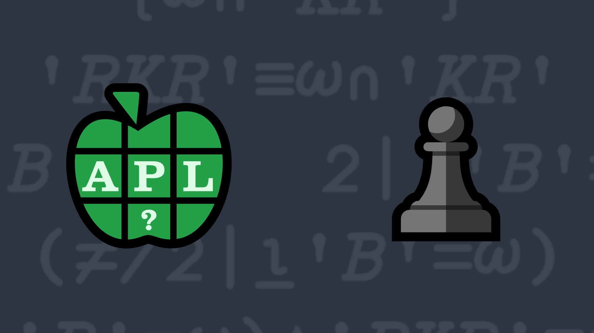

# <span class=s>2021-</span>6: Fischer Random Chess

<div>
 
</div>
<div><p>According to <a href="https://en.wikipedia.org/wiki/Fischer_random_chess">Wikipedia</a>, Fischer random chess is a
      variation of the game of chess invented by former world chess champion Bobby Fischer. Fischer random chess employs
      the same board and pieces as standard chess, but the starting position of the non-pawn pieces on the players' home ranks is
      randomized, following certain rules. White's non-pawn pieces are placed on the first rank according to the
      following rules:</p>
<ul>
      <li>The Bishops must be placed on opposite-color squares.</li>
      <li>The King must be placed on a square between the rooks.</li>
</ul>
</div>

<!-- Write a function that as a character vector right argument that is a permutation of 'KQRRBBNN' and returns 1 if the K is between the two Rs and the Bs occupy one odd and one even position; and otherwise returns a 0.-->

<p>The good news is that you don't actually need to know anything about chess to solve this problem! We'll use strings
      whose elements are <code class="language-APL">'KQRRBBNN'</code> for the King (♔), Queen (♕), 2 Rooks (♖), 2 Bishops (♗), and 2
      kNights (♘) respectively.</p>
<p>Write a function that:</p>
<ul>
      <li>has a character vector right argument that is a permutation of <code class="language-APL">'KQRRBBNN'</code></li>
      <li>returns 1 if the following are true:<ul>
                  <li>the K is between the two Rs</li>
                  <li>the Bs occupy one odd and one even position</li>
            </ul>otherwise a 0 is returned.</li>
</ul>

💡 Hint: The <em>where</em> function <a href="https://help.dyalog.com/latest/#Language/Primitive%20Functions/Where.htm" class="language-APL" target="_blank">⍸Y</a> and the <em>residue</em> function <a href="https://help.dyalog.com/latest/#Language/Primitive%20Functions/Residue.htm" class="language-APL" target="_blank">X|Y</a> could help with solving this problem.

### Examples

```APL
      
      (your_function) 'RNBQKBNR' ⍝ standard chess layout
1

      (your_function) 'BBNRKNRQ' ⍝ layout in diagram above
1

      (your_function) 'RBBNQNRK' ⍝ K not between Rs
0

      (your_function) 'BRBKRNQN' ⍝ Bs both in odd positions 
0
```
<div class="pdiv">
  <code onclick="p_Input.focus()">your_function ← </code><input id="p_Input" autocomplete="off" spellcheck="false" oninput="this.parentElement.querySelector`button`.disabled=false;localStorage.setItem(window.location.pathname,this.value)" onkeypress="subm(event)">
  <button onclick="alert$.next`Testing…`;submitSolution`p`" class="md-button md-button--primary">&#x2714; Test</button>
</div>
<blockquote id="p_Output"></blockquote>
## Solutions
<div onclick="play(this)" title="Video on YouTube" class="yt">

<time>3:20</time>

</div>
<a href="https://chat.stackexchange.com/transcript/52405?m=64457542#64457542" target="_blank" class="md-button md-button--primary">Chat transcript</a>
<a href="https://github.com/abrudz/apl_quest/tree/main/2021/6.apl" target="_blank" class="md-button md-button--primary right">Code on GitHub</a>

<script>
    testCases={"a":["'RNBQKBNR'","'BBNRKNRQ'","'RBBNQNRK'","'BRBKRNQN'","'BRBKRNQN'[?⍨8]"],"b":["''"],"f":"{(≠/(⍸'R'=⍵)<⍵⍳'K')∧(≠/2|⍸'B'=⍵)}","p":","}
    p_Input.value=localStorage.getItem(window.location.pathname)
    play=e=>e.outerHTML=`<iframe src="https://www.youtube.com/embed/UvlL1OyIJIw?list=PLYKQVqyrAEj9wDIUyLDGtDAFTKY38BUMN&autoplay=1" title="<span class=s>2021-</span>6: Fischer Random Chess (APL Quest 2021-6)" frameborder="0" allow="accelerometer; autoplay; clipboard-write; encrypted-media; gyroscope; picture-in-picture; web-share" referrerpolicy="strict-origin-when-cross-origin" allowfullscreen></iframe>`
</script>
