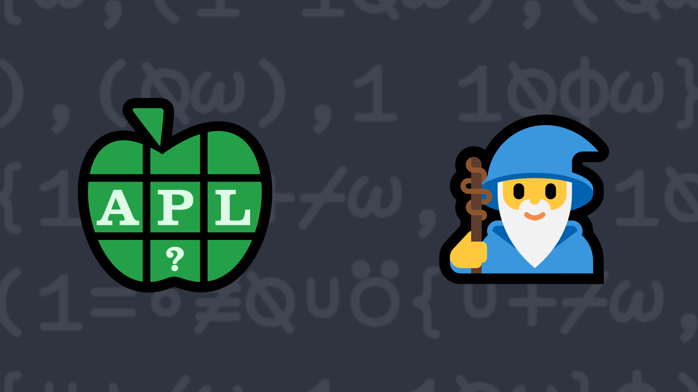

# <span class=s>2021-</span>7: Can You Feel the Magic?

<div>
      
</div>
<p><a href="https://en.wikipedia.org/wiki/Magic_square">Wikipedia</a> states that, in recreational mathematics, a square array of numbers, usually positive integers, is called a magic square if the sums of the numbers in each row, each column, and both main diagonals are the same.</p>
<p>Write a function to test whether an array is a magic square. The function must:</p>
<ul>
      <li>have a right argument that is a square matrix of integers (not necessarily all positive integers)</li>
      <li>return 1 if the array represents a magic square, otherwise return 0</li>
</ul>

💡 Hint: The <em>dyadic transpose</em> <a href="https://aplcart.info/?q=%E2%8D%89#" class="language-APL" target="_blank">X⍉Y</a> function could be helpful for solving this problem.

### Examples:

```APL
      (your_function) 1 1⍴42
1

      (your_function) 3 3⍴4 9 2 3 5 7 8 1 6
1

      (your_function) 2 2⍴1 2 3 4
0
```
<div class="pdiv">
  <code onclick="p_Input.focus()">your_function ← </code><input id="p_Input" autocomplete="off" spellcheck="false" oninput="this.parentElement.querySelector`button`.disabled=false;localStorage.setItem(window.location.pathname,this.value)" onkeypress="subm(event)">
  <button onclick="alert$.next`Testing…`;submitSolution`p`" class="md-button md-button--primary">&#x2714; Test</button>
</div>
<p id="p_Output"></p>
## Solutions
<div onclick="if(event.target.tagName!='A'){play(this)}" title="Video on YouTube" class="yt">

<div>Click to load video from YouTube. This will enable YouTube tracking. <a href="https://support.google.com/youtube/answer/10364219" target="_blank" rel="noopener">YouTube Privacy Information</a></div>
<time>7:41</time>

</div>
<a href="https://chat.stackexchange.com/transcript/52405?m=64501098#64501098" target="_blank" class="md-button md-button--primary">Chat transcript</a>
<a href="https://github.com/abrudz/apl_quest/tree/main/2021/7.apl" target="_blank" class="md-button md-button--primary right">Code on GitHub</a>

<script>
    testCases={"a":["1 1⍴42","3 3⍴4 9 2 3 5 7 8 1 6","2 2⍴2","2 2⍴2 2 2 4","2 2⍴1 2 3 4","3 3⍴10 3 8 5 7 9 6 11 4","(0(=+⊢)¯3+?5)×3 3⍴4 9 2 3 5 7 8 1 6","(0(=+⊢)¯3+?5)+3 3⍴4 9 2 3 5 7 8 1 5","3 3⍴3 2 4 4 3 2 2 4 3","3 3⍴2 4 ¯1 ¯1 1 5 6 2 3","3 3⍴27 15 ¯15 ¯26 13 58 32 5 ¯10","3 3⍴18 42 ¯47 ¯51 3 79 68 ¯10 3","3 3⍴12 30 ¯31 ¯41 1 45 36 ¯24 ¯7","3 3⍴30 18 7 ¯19 ¯7 27 12 12 ¯11","3 3⍴36 24 ¯21 ¯31 17 83 40 4 ¯17","3 3⍴9 15 ¯2 ¯4 ¯1 18 18 9 7","3 3⍴6 3 ¯6 ¯7 5 5 4 ¯5 4","3 3⍴9 18 ¯22 ¯20 7 18 24 ¯12 17","3 3⍴30 24 ¯28 ¯38 19 51 36 ¯15 5","3 3⍴21 6 ¯26 ¯33 6 58 29 5 ¯15","3 3⍴24 30 ¯5 ¯15 9 25 20 ¯10 9","3 3⍴12 12 9 13 7 ¯5 8 14 29","3 3⍴21 15 ¯13 ¯26 4 33 18 ¯6 ¯7","3 3⍴18 12 47 61 7 ¯15 ¯12 48 35","3 3⍴10 10 ¯5 ¯29 7 37 28 ¯8 ¯5","3 3⍴6 9 ¯12 ¯20 1 22 17 ¯7 ¯4","3 3⍴15 12 ¯13 ¯37 14 67 38 ¯10 ¯14","3 3⍴12 27 ¯17 ¯23 13 59 43 ¯8 2","3 3⍴3 30 13 ¯13 8 27 30 ¯18 10","3 3⍴21 24 ¯12 ¯41 7 61 53 2 2","3 3⍴48 6 35 ¯31 17 79 32 26 ¯23","3 3⍴12 24 41 13 7 15 18 12 17","3 3⍴18 18 ¯17 ¯21 21 19 20 ¯22 21","3 3⍴9 27 ¯11 ¯36 18 43 44 ¯28 15","3 3⍴9 21 ¯11 ¯18 18 28 26 ¯22 15","3 3⍴24 30 ¯28 ¯59 19 78 63 ¯21 5","3 3⍴27 3 29 ¯11 10 30 15 18 ¯4","3 3⍴9 30 ¯13 ¯16 11 22 26 ¯22 16","3 3⍴3 30 17 9 18 26 22 ¯14 18","3 3⍴27 27 ¯14 ¯48 18 76 47 ¯19 ¯6","3 3⍴10 9 ¯8 ¯11 3 19 14 1 ¯4","3 3⍴15 3 ¯7 ¯13 2 22 14 11 ¯8","3 3⍴15 27 ¯32 ¯22 8 54 33 ¯9 ¯14","3 3⍴6 6 47 89 11 ¯35 ¯4 74 37","3 3⍴36 18 37 53 17 3 6 60 7","3 3⍴48 6 ¯9 ¯29 ¯5 49 26 44 ¯31","3 3⍴24 6 33 37 19 13 2 38 11","3 3⍴12 30 6 13 7 19 14 2 8","3 3⍴15 21 ¯17 ¯11 13 17 19 ¯11 11","3 3⍴42 24 ¯7 ¯23 19 63 48 24 5","3 3⍴18 42 ¯31 ¯25 17 55 44 ¯22 7","3 3⍴30 24 ¯41 ¯41 4 56 46 7 ¯10","3 3⍴3 27 15 35 8 ¯16 1 4 22","3 3⍴36 54 ¯23 ¯27 15 31 32 ¯28 21","3 3⍴3 15 11 34 4 ¯9 ¯9 9 5","3 3⍴15 15 13 26 11 3 ¯3 12 13","3 3⍴12 14 ¯3 ¯5 7 21 18 4 1","3 3⍴21 6 ¯14 ¯41 4 50 34 4 ¯13","3 3⍴27 12 ¯10 ¯9 12 47 25 19 ¯15","3 3⍴27 30 ¯35 ¯56 7 83 64 ¯2 ¯16","3 3⍴24 36 33 17 5 17 22 22 ¯5","3 3⍴12 12 65 49 1 ¯21 ¯6 42 23","3 3⍴6 21 15 4 10 19 23 2 5","3 3⍴18 24 39 31 7 25 38 56 11","3 3⍴24 54 ¯19 17 35 7 32 ¯16 43","3 3⍴12 36 ¯29 ¯41 19 41 52 ¯32 23","3 3⍴3 30 ¯8 12 15 28 23 ¯7 9","3 3⍴42 18 ¯19 ¯61 41 97 68 ¯10 13","3 3⍴15 9 16 3 15 7 11 5 9","3 3⍴15 24 ¯18 ¯28 ¯1 29 28 ¯8 1","3 3⍴36 54 23 27 27 23 28 10 21","3 3⍴18 6 13 11 9 7 4 18 7"],"b":["0 0⍴0","⍪¯1","-4 4⍴16 3 2 13 5 10 11 8 9 6 7 12 4 15 14 1","-4 4⍴16 3 2 13 5 10 11 8 9 6 7 12 4 15 14 2","5 5⍴0","¯50+?3 3⍴100","↑(1 0 0 1)(0 1 1 0)(0 1 1 0)(1 0 0 1)","↑(0 1 0 1 0)(0 1 0 1 0)(1 0 0 0 1)(0 1 0 1 0)(0 1 0 1 0)","⍉↑(0 1 0 1 0)(0 1 0 1 0)(1 0 0 0 1)(0 1 0 1 0)(0 1 0 1 0)"],"f":"1=∘≢∘∪(+/1 1∘⍉)⍪+/,+⌿,1⊥1 1⍉⌽","p":","}
    p_Input.value=localStorage.getItem(window.location.pathname)
    play=e=>e.outerHTML=`<iframe class="md-header--shadow" src="https://www.youtube.com/embed/j9MMQZXpTmM?list=PLYKQVqyrAEj9wDIUyLDGtDAFTKY38BUMN&autoplay=1" title="<span class=s>2021-</span>7: Can You Feel the Magic? (APL Quest 2021-7)" frameborder="0" allow="accelerometer; autoplay; clipboard-write; encrypted-media; gyroscope; picture-in-picture; web-share" referrerpolicy="strict-origin-when-cross-origin" allowfullscreen></iframe>`
</script>
