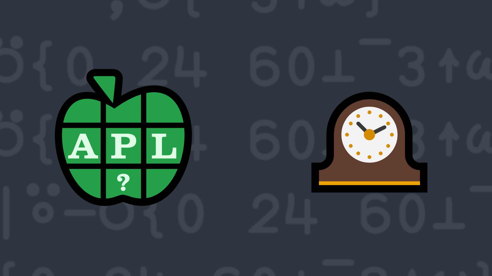

# <span class=s>2021-</span>8: Time to Make a Difference

<!-- Write a function that returns the number of minutes between two timestamps. -->

Write a function that:

- has a right argument that is a numeric scalar or vector of length up to 3, representing a number of [[[days] hours] minutes] – a single number represents minutes, a 2-element vector represents hours and minutes, and a 3-element vector represents days, hours, and minutes.
- has a similar left argument, although not necessarily the same length as the right argument.
- returns a single number representing the magnitude of the difference in minutes between the arguments.

💡 Hint: The functions <em>decode</em> <a href="https://help.dyalog.com/latest/#Language/Primitive%20Functions/Decode.htm" class="language-APL" target="_blank">X⊥Y</a> and <em>take</em> <a href="https://help.dyalog.com/latest/#Language/Primitive%20Functions/Take.htm" class="language-APL" target="_blank">↑</a>  could be useful for this problem.

### Examples:

```APL
      2 30 (your_function) 5 15
165
      5 15 (your_function) 2 30
165
      1 0 0 (your_function) 0 ⍝ number of minutes in a day
1440
      1 0 0 (your_function) ⍬ ⍝ don't forget to handle empty arguments!
1440
      1 0 (your_function) ¯1 0
120
      1.5 0 (your_function) 90
0
```
<div class="pdiv">
  <code onclick="p_Input.focus()">your_function ← </code><input id="p_Input" autocomplete="off" spellcheck="false" oninput="this.parentElement.querySelector`button`.disabled=false;localStorage.setItem(window.location.pathname,this.value)" onkeypress="subm(event)">
  <button onclick="alert$.next`Testing…`;submitSolution`p`" class="md-button md-button--primary">&#x2714; Test</button>
</div>
<p id="p_Output"></p>
## Solutions
<div onclick="if(event.target.tagName!='A'){play(this)}" title="Video on YouTube" class="yt">

<div>Click to load video from YouTube. This will enable YouTube tracking. <a href="https://support.google.com/youtube/answer/10364219" target="_blank" rel="noopener">YouTube Privacy Information</a></div>
<time>2:57</time>

</div>
<a href="https://chat.stackexchange.com/transcript/52405?m=64533505#64533505" target="_blank" class="md-button md-button--primary">Chat transcript</a>
<a href="https://github.com/abrudz/apl_quest/tree/main/2021/8.apl" target="_blank" class="md-button md-button--primary right">Code on GitHub</a>

<script>
    testCases={"a":[["2 30","5 15"],["5 15","2 30"],["1 0 0","0"],["1 0","¯1 0"],["1.5 0","90"],["¯100+?1⍴200","¯100+?1⍴200"],["¯100+?1⍴200","¯100+?2⍴200"],["¯100+?1⍴200","¯100+?3⍴200"],["¯100+?1⍴200","¯100+?⍬⍴200"],["¯100+?2⍴200","¯100+?1⍴200"],["¯100+?2⍴200","¯100+?2⍴200"],["¯100+?2⍴200","¯100+?3⍴200"],["¯100+?2⍴200","¯100+?⍬⍴200"],["¯100+?3⍴200","¯100+?1⍴200"],["¯100+?3⍴200","¯100+?2⍴200"],["¯100+?3⍴200","¯100+?3⍴200"],["¯100+?3⍴200","¯100+?⍬⍴200"],["¯100+?⍬⍴200","¯100+?1⍴200"],["¯100+?⍬⍴200","¯100+?2⍴200"],["¯100+?⍬⍴200","¯100+?3⍴200"],["¯100+?⍬⍴200","¯100+?⍬⍴200"]],"b":[["⍬","¯100+?1⍴200"],["⍬","¯100+?2⍴200"],["⍬","¯100+?3⍴200"],["⍬","¯100+?⍬⍴200"],["¯100+?1⍴200","⍬"],["¯100+?2⍴200","⍬"],["¯100+?3⍴200","⍬"],["¯100+?3⍴200","⍬"],["⍬","⍬"]],"f":"{|-/(0 24 60⊥¯3∘↑)¨⍺⍵}","p":","}
    p_Input.value=localStorage.getItem(window.location.pathname)
    play=e=>e.outerHTML=`<iframe class="md-header--shadow" src="https://www.youtube.com/embed/hQFMjRPFioI?list=PLYKQVqyrAEj9wDIUyLDGtDAFTKY38BUMN&autoplay=1" title="<span class=s>2021-</span>8: Time to Make a Difference (APL Quest 2021-8)" frameborder="0" allow="accelerometer; autoplay; clipboard-write; encrypted-media; gyroscope; picture-in-picture; web-share" referrerpolicy="strict-origin-when-cross-origin" allowfullscreen></iframe>`
</script>
