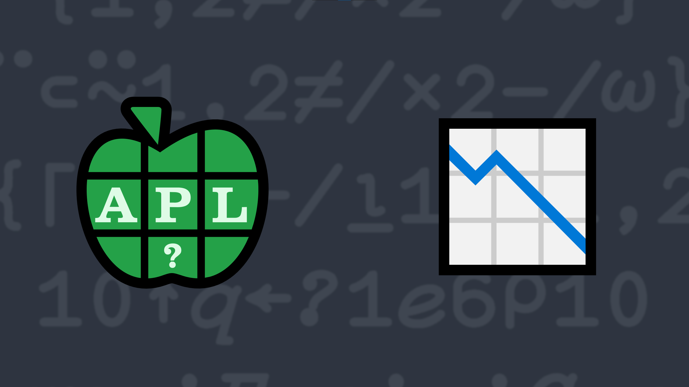

# 9: In the Long Run

Write a function that:

<ul>
      <li>has a right argument that is a numeric vector of 2 or more elements representing daily prices of a stock.</li>
      <li>returns an integer singleton that represents the highest number of consecutive days where the price increased, decreased, or remained the same, relative to the previous day.</li>
</ul>

💡 Hint: The <em>N-wise reduction</em> operator <a href="https://help.dyalog.com/latest/#Language/Primitive%20Operators/Reduce%20N%20Wise.htm" class="language-APL" target="_blank">X f/ Y</a> function could be useful when solving this problem.

### Examples (the longest runs are highlighted)

<pre class="language-APL">
      (your_function) 1 2 3 5 5 5 6 4 3
3
      (your_function) 1 2 3 4 4 4 4 4 5 4 3
4
      (your_function) 1 2
1
</pre>

  <code>your_function ← </code><input id="p_Input" autocomplete="off" spellcheck="false">
  <button onclick="alert$.next`Testing…`;submitSolution`p`" class="md-button">&#x2714; Test</button>

<blockquote id="p_Output"></blockquote>
??? info "Solutions"
    

        
        
    

    [Chat transcript](https://chat.stackexchange.com/transcript/52405?m=64569242#64569242)&emsp;∙&emsp;[Code on GitHub](https://github.com/abrudz/apl_quest/tree/main/2021/9.apl)

