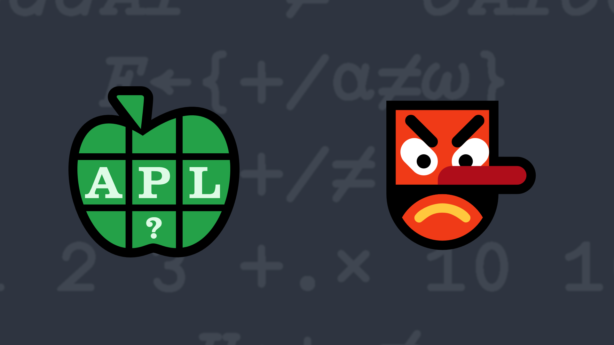

# 2022-2: Attack of the Mutations!

<!-- Write a function that takes right and left arguments that are character vectors or scalars of equal length – these represent DNA strings – and returns an integer representing the Hamming distance (the number of differences in corresponding positions) between the arguments. -->

This problem is inspired by the <a href="https://rosalind.info/problems/hamm/">Counting Point Mutations</a> problem found on the excellent Bioinformatics education website <a href="https://rosalind.info">rosalind.info</a>.

Write a function that:

<ul>
    <li>takes right and left arguments that are character vectors or scalars of equal length – these represent DNA strings.</li>
    <li>returns an integer representing the <a href="https://rosalind.info/glossary/hamming-distance/">Hamming distance</a> (the number of differences in corresponding positions) between the arguments.</li>
</ul>

<i class="fas fa-lightbulb-on"></i> <strong>Hint:</strong> The <em>plus</em> function <a href="https://help.dyalog.com/latest/Content/Language/Symbols/Plus.htm" class="APL" target="_blank">X+Y</a> could be helpful.

<h3>Examples</h3>
<pre class="APL">
      'GAGCCTACTAACGGGAT' (your_function) 'CATCGTAATGACGGCCT' 
7

      'A' (your_function) 'T'
1

      '' (your_function) ''
0
 
      (your_function) ⍨ 'CATCGTAATGACGGCCT'
0
</pre>

  <code onclick="p_Input.focus()">your_function ← </code><input id="p_Input" autocomplete="off" spellcheck="false" oninput="this.parentElement.querySelector`button`.disabled=false;localStorage.setItem(window.location.pathname,this.value)" onkeypress="subm(event)">
  <button onclick="alert$.next`Testing…`;submitSolution`p`" class="md-button md-button--primary">&#x2714; Test</button>

<blockquote id="p_Output"></blockquote>
## Solutions

<a href="https://chat.stackexchange.com/transcript/52405?m=64668644#64668644" target="_blank" class="md-button md-button--primary">Chat transcript</a>
<a href="https://github.com/dyalog/apl.quest/tree/main/2022/2.apl" target="_blank" class="md-button md-button--primary right">Code on GitHub</a>

