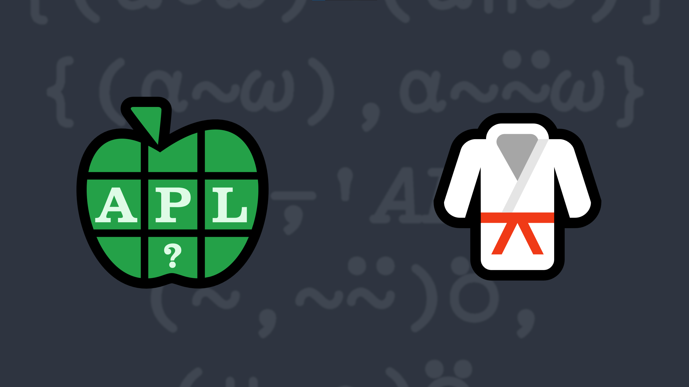

# 3: Uniquely Qualified

Write a function that:

    <ul>
        <li>takes right and left arguments that are arrays of arbitrary rank, depth, and value.</li>
        <li>returns a vector of all elements that appear in either of the two argument arrays but not in both. The order of elements in the result is not significant.</li>
    </ul>

<i class="fas fa-lightbulb-on"></i> <strong>Hint:</strong> The <em>without</em> function <a href="http://help.dyalog.com/latest/#Language/Primitive%20Functions/Excluding.htm" class="APL" target="_blank">X~Y</a> could be helpful.

<h3>Examples</h3>
<pre class="APL">
      'DYALOG' (<i>your_function</i>) 'APL'
DYOGP

      'DYALOG'  (<i>your_function</i>) ⊂'APL'
┌─┬─┬─┬─┬─┬─┬───┐
│D│Y│A│L│O│G│APL│
└─┴─┴─┴─┴─┴─┴───┘

      (2 2⍴'Hello'(⊂'World')(2 2⍴⍳4)42) (<i>your_function</i>) 42 'Have a nice day'
┌─────┬───────┬───┬───────────────┐
│Hello│┌─────┐│1 2│Have a nice day│
│     ││World││3 4│               │
│     │└─────┘│   │               │
└─────┴───────┴───┴───────────────┘

      1 1 1 (<i>your_function</i>) 2 2
1 1 1 2 2
</pre>

  <code>your_function ← </code><input id="p_Input" autocomplete="off" spellcheck="false">
  <button onclick="alert$.next`Testing…`;submitSolution`p`" class="md-button">&#x2714; Test</button>

<blockquote id="p_Output"></blockquote>
??? info "Solutions"
    

        
        
    

    [Chat transcript](https://chat.stackexchange.com/transcript/52405?m=64700500#64700500) ∙ [Code on GitHub](https://github.com/abrudz/apl_quest/tree/main/2022/3.apl)

