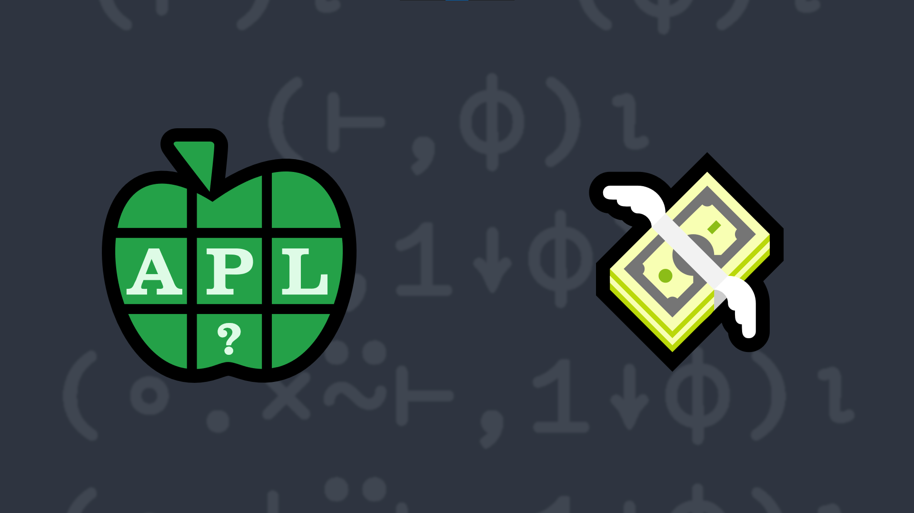

# 2022-6: Pyramid Scheme
<!-- Write a monadic function that takes an argument <em>n</em> that is an integer scalar in the range 0-100 and returns a square matrix "pyramid" with 0⌈¯1+2×n rows and columns of n increasing concentric levels. -->

Write a monadic function that:

<ul>
    <li>takes an argument <em>n</em> that is an integer scalar in the range 0-100.</li>
    <li>returns a square matrix "pyramid" with 0⌈¯1+2×n rows and columns of n increasing concentric levels. 
        By this we mean that the center element of the matrix will be n, surrounded on all sides by n-1.</li>
</ul>

<i class="fas fa-lightbulb-on"></i> <strong>Hint:</strong> The functions <em>minimum</em> <a href="https://help.dyalog.com/latest/#Language/Primitive%20Functions/Minimum.htm" class="APL" target="_blank">X⌊Y</a> and <em>reverse</em> <a href="https://help.dyalog.com/latest/#Language/Primitive%20Functions/Reverse.htm"
      class="APL" target="_blank">⌽Y</a>, and the <em>outer product</em> operator <a href="http://help.dyalog.com/latest/#Language/Primitive%20Operators/Outer%20Product.htm"
      class="APL" target="_blank">X∘.gY</a> could be helpful.

### Examples:
<pre class="APL">
      (your_function) 3
1 1 1 1 1
1 2 2 2 1
1 2 3 2 1
1 2 2 2 1
1 1 1 1 1

      (your_function) 5
1 1 1 1 1 1 1 1 1
1 2 2 2 2 2 2 2 1
1 2 3 3 3 3 3 2 1
1 2 3 4 4 4 3 2 1
1 2 3 4 5 4 3 2 1
1 2 3 4 4 4 3 2 1
1 2 3 3 3 3 3 2 1
1 2 2 2 2 2 2 2 1
1 1 1 1 1 1 1 1 1
      
      (your_function) 1 ⍝ should return 1 1⍴1
1      

      (your_function) 0 ⍝ should return 0 0⍴0

</pre>

  <code onclick="p_Input.focus()">your_function ← </code><input id="p_Input" autocomplete="off" spellcheck="false" oninput="this.parentElement.querySelector`button`.disabled=false;localStorage.setItem(window.location.pathname,this.value)" onkeypress="subm(event)">
  <button onclick="alert$.next`Testing…`;submitSolution`p`" class="md-button md-button--primary">&#x2714; Test</button>

## Solutions

Click to load video from YouTube. This will enable YouTube tracking. <a href="https://support.google.com/youtube/answer/10364219" target="_blank" rel="noopener">YouTube Privacy Information</a>

<time>3:14</time>

<a href="https://chat.stackexchange.com/transcript/52405?m=64793494#64793494" target="_blank" class="md-button md-button--primary">Chat transcript</a>
<a href="https://github.com/abrudz/apl_quest/tree/main/2022/6.apl" target="_blank" class="md-button md-button--primary right">Code on GitHub</a>

