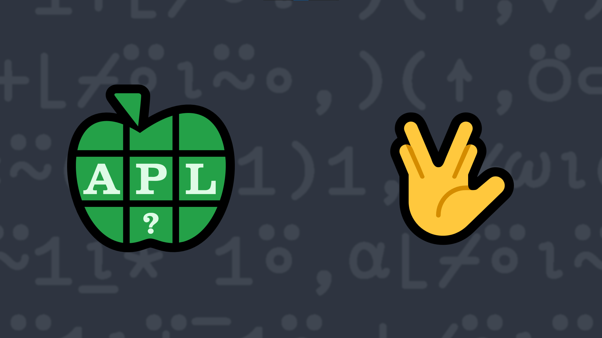

# 2022-8: Let's Split!
<!-- Write a function that takes non-empty character vector or scalar arguments and returns a 2-element vector of character vectors in which the right argument is split immediately before the <em>first</em> occurence of <em>any</em> element in the left argument. -->

Write a function that:

<ul>
    <li>takes a right argument that is a non-empty character vector or scalar.</li>
    <li>takes a left argument that is a non-empty character vector or scalar.</li>
    <li>returns a 2-element vector of character vectors in which the right argument is split immediately before the <em>first</em> occurence of <em>any</em> element in the left argument. If no left-argument element occurs in the right argument, then the split
        should happen after the last element of the right argument.</li>
</ul>

<i class="fas fa-lightbulb-on"></i> <strong>Hint:</strong> The <em>take</em>
    <a href="https://help.dyalog.com/latest/#Language/Primitive%20Functions/Take.htm" class="APL" target="_blank">X↑Y</a> and <em>drop</em>
    <a href="https://help.dyalog.com/latest/#Language/Primitive%20Functions/Drop.htm" class="APL" target="_blank">X↓Y</a> functions, or the <em>partitioned enclose</em> function
    <a href="https://help.dyalog.com/latest/#Language/Primitive Functions/Partitioned Enclose.htm" class="APL" target="_blank">X⊂Y</a>, could be helpful.

### Examples:
<pre class="APL">
      'do' (your_function) 'Hello World'
┌────┬───────┐
│Hell│o World│
└────┴───────┘

      'KEI' (your_function) ⎕A ⍝ ⎕A is the system constant that contains the characters A-Z 
┌────┬──────────────────────┐
│ABCD│EFGHIJKLMNOPQRSTUVWXYZ│
└────┴──────────────────────┘

      (⌽⎕A) (your_function) ⎕A
┌┬──────────────────────────┐
││ABCDEFGHIJKLMNOPQRSTUVWXYZ│
└┴──────────────────────────┘

      ⎕D (your_function) ⎕A ⍝ ⎕D is the system constant that contains the characters 0-9 
┌──────────────────────────┬┐
│ABCDEFGHIJKLMNOPQRSTUVWXYZ││
└──────────────────────────┴┘

      ⎕D (your_function) 'Q'
┌─┬┐
│Q││
└─┴┘
      ⎕A (your_function) 'Q'
┌┬─┐
││Q│
└┴─┘
</pre>

  <code onclick="p_Input.focus()">your_function ← </code><input id="p_Input" autocomplete="off" spellcheck="false" oninput="this.parentElement.querySelector`button`.disabled=false;localStorage.setItem(window.location.pathname,this.value)" onkeypress="subm(event)">
  <button onclick="alert$.next`Testing…`;submitSolution`p`" class="md-button md-button--primary">&#x2714; Test</button>

## Solutions

<time>10:08</time>

<a href="https://chat.stackexchange.com/transcript/52405?m=64863116#64863116" target="_blank" class="md-button md-button--primary">Chat transcript</a>
<a href="https://github.com/abrudz/apl_quest/tree/main/2022/8.apl" target="_blank" class="md-button md-button--primary right">Code on GitHub</a>

