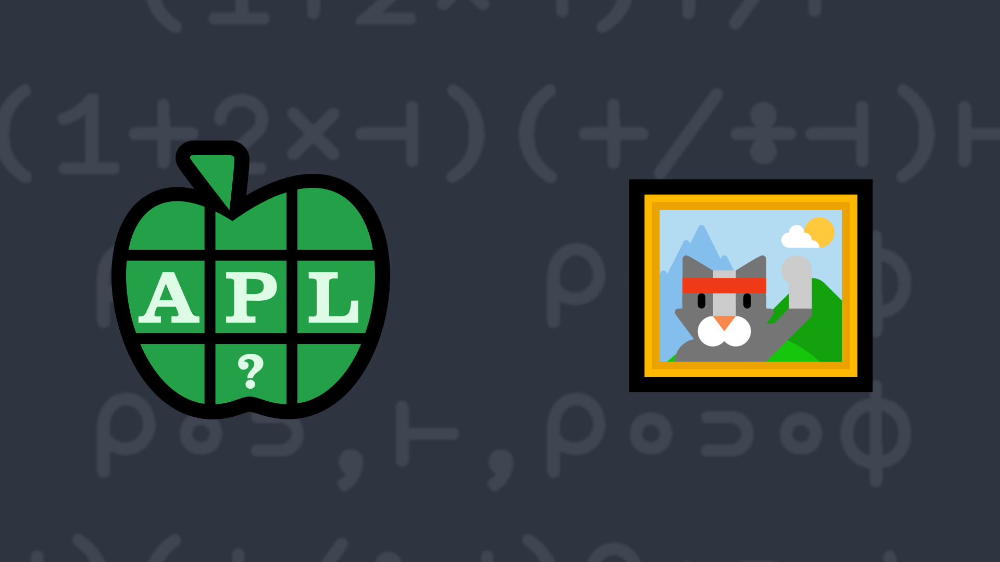

# 2022-9: An Average Window (or a Windowed Average)

Write a function that:

<ul>
    <li>takes a right argument Y that is a numeric scalar or non-empty vector.</li>
    <li>takes a left argument X that represents the number of neighboring elements on either side of each element in Y.</li>
    <li>returns a numeric vector or scalar where each element is the average (mean) of the corresponding element in Y and its X neighbors on either side. If an element has fewer than X neighbors on either side, replicate the first and last values as necessary to make X neighbors.</li>
</ul>

<i class="fas fa-lightbulb-on"></i> <strong>Hint:</strong> The <em>Reduce N-Wise</em> operator <a href="http://help.dyalog.com/latest/#Language/Primitive%20Operators/Reduce%20N%20Wise.htm" class="APL" target="_blank">Xf/Y</a> could help with solving this
    problem.

### Examples:
<pre class="APL">

      0 (your_function) 1 2 3 4 5 6 ⍝ 0 neighbors on each side
1 2 3 4 5 6

      1 (your_function) 1 2 3 4 5 6 ⍝ 1 neighbors on each side
1.333333333 2 3 4 5 5.666666667

      2 (your_function) 1 2 3 4 5 6 ⍝ 2 neighbors on each side
1.6 2.2 3 4 4.8 5.4

      6 (your_function) 1 2 3 4 5 6
2.538461538 2.923076923 3.307692308 3.692307692 4.076923077 4.461538462

      10 (your_function) 42
42    
</pre>

  <code onclick="p_Input.focus()">your_function ← </code><input id="p_Input" autocomplete="off" spellcheck="false" oninput="this.parentElement.querySelector`button`.disabled=false;localStorage.setItem(window.location.pathname,this.value)" onkeypress="subm(event)">
  <button onclick="alert$.next`Testing…`;submitSolution`p`" class="md-button md-button--primary">&#x2714; Test</button>

## Solutions

<time>6:29</time>

<a href="https://chat.stackexchange.com/transcript/52405?m=64894638#64894638" target="_blank" class="md-button md-button--primary">Chat transcript</a>
<a href="https://github.com/abrudz/apl_quest/tree/main/2022/9.apl" target="_blank" class="md-button md-button--primary right">Code on GitHub</a>

