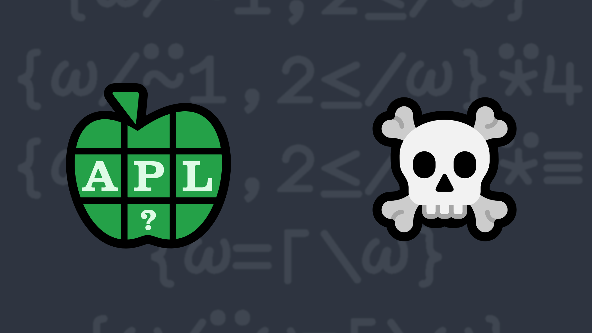

# 2023-1: Elimination Sort

An “Elimination Sort” is a somewhat farcical sorting algorithm which starts with the leftmost element and keeps subsequent elements that are at least as large as the previous kept element, discarding all other elements. For example:

<pre class="APL">
      EliminationSort 1 3 7 3 5 8 5 8 1 6 1 8 1 10 8 4 3 4 1 4
1 3 7 8 8 8 10 
</pre>
<!-- Write a function that takes a non-empty numeric vector right argument and returns an "Elimination-sorted" vector of the right argument. -->

Write a function that:

<ul>
    <li>takes a non-empty numeric vector right argument</li>
    <li>returns an "Elimination-sorted" vector of the right argument</li>
    </ul>

<i class="fas fa-lightbulb-on"></i> <strong>Hint:</strong> The <em>progressive-maxima</em> idiomatic phrase <a href="https://aplcart.info?q=progressive%20maxima" class="APL" target="_blank">⌈\</a>, the <em>greater or equal</em> function <a class="APL" href="https://help.dyalog.com/latest/#Language/Primitive%20Functions/Greater%20Or%20Equal.htm" target="_blank">≥</a>, and the <em>replicate</em> function <a class="APL" href="https://help.dyalog.com/latest/#Language/Primitive%20Functions/Replicate.htm" target="_blank">/</a> could be helpful in solving this problem.

### Examples:
<pre class="APL">
      (your_function) ⍳10
1 2 3 4 5 6 7 8 9 10

      (your_function) 2 1 4 3 6 5 8 7 10 9
2 4 6 8 10

      (your_function) 1000 2500 1333 1969 3141 2345 3141 4291.9 4291.8 4292
1000 2500 3141 3141 4291.9 4292

      (your_function) 1 3 7 3 5 8 5 8 1 6 1 8 1 10 8 4 3 4 1 4
1 3 7 8 8 8 10 
</pre>

<!-- 

  

    Spoiler: Solutions
  

  
<a target="_blank" href="https://chat.stackexchange.com/transcript/52405?m=64941297#64941297">Transcript from discussion on this problem</a>, <a target="_blank" href="https://github.com/abrudz/apl_quest/tree/main/2023/1.apl">source code</a>, video presentation:

  <iframe src="https://www.youtube.com/embed/LpUOaipgn7s?list=PLYKQVqyrAEj9wDIUyLDGtDAFTKY38BUMN" title="Elimination Sort (APL Quest 2023-1)" allowfullscreen="" width="960" height="540" allow="accelerometer; encrypted-media; gyroscope; picture-in-picture; web-share"></iframe>

 -->

  <code onclick="p_Input.focus()">your_function ← </code><input id="p_Input" autocomplete="off" spellcheck="false" oninput="this.parentElement.querySelector`button`.disabled=false;localStorage.setItem(window.location.pathname,this.value)" onkeypress="subm(event)">
  <button onclick="alert$.next`Testing…`;submitSolution`p`" class="md-button md-button--primary">&#x2714; Test</button>

## Solutions

<time>3:56</time>

<a href="https://chat.stackexchange.com/transcript/52405?m=64941297#64941297" target="_blank" class="md-button md-button--primary">Chat transcript</a>
<a href="https://github.com/abrudz/apl_quest/tree/main/2023/1.apl" target="_blank" class="md-button md-button--primary right">Code on GitHub</a>

