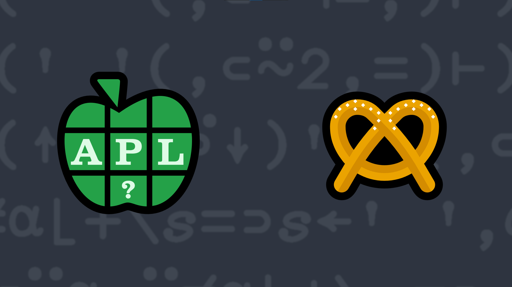

# 2023-10: Partition with a Twist
<!-- Write a function that takes a non-negative integer and a space-delimited character vector and splits the character vector into the given number of sub-strings. -->

Splitting delimited data into sub-arrays using partitioning on a delimiter character (or characters) is a fairly common operation in APL. For instance, if you partition the character vector 'this is an example' on each occurrence of the space character, there would be 4 sub-arrays: 'this' 'is' 'an' 'example'. This problem adds a slight twist to the operation in that the left argument indicates how many sub-arrays to return.

Write a function that:

- takes a non-negative integer left argument, <strong>N</strong>
- takes a space-delimited character vector right argument, <strong>string</strong>
- returns an array of length <strong>N</strong> where:
    - if <strong>N</strong> is less than or equal to the number of sub-arrays in <strong>string</strong>, the first <strong>N-1</strong> elements of the result are the first <strong>N-1</strong> space-delimited partitions in <strong>string</strong>.  The <strong>N</strong>th element of the result is the remaining portion of <strong>string</strong>.
    - if <strong>N</strong> is greater than the number of sub-arrays, pad the result with as many empty arrays as necessary to achieve length <strong>N</strong>.

<strong>Note: </strong>Each space in <strong>string</strong> be considered as a delimiter. This means that leading, trailing, or contiguous spaces are potentially significant.

<i class="fas fa-lightbulb-on"></i> <strong>Hint:</strong> The <em>partitioned enclose</em> function <a href="https://help.dyalog.com/latest/Content/Language/Primitive%20Functions/Partitioned%20Enclose.htm" class="APL" target="_blank">⊂</a> could be helpful in solving this problem.

### Examples:
<pre class="APL">
      1 (your_function) 'this is a sample'
┌────────────────┐
│this is a sample│
└────────────────┘

      2 (your_function) 'this is a sample'
┌────┬───────────┐
│this│is a sample│
└────┴───────────┘

      4 (your_function) 'this is a sample'
┌────┬──┬─┬──────┐
│this│is│a│sample│
└────┴──┴─┴──────┘

      ⍴¨4 (your_function) 'this is a sample' ⍝ each sub-array is a vector
┌─┬─┬─┬─┐
│4│2│1│6│
└─┴─┴─┴─┘

      13 (your_function) '  this  is  a sample  ' ⍝ note the leading, trailing, and multiple interior spaces 
┌┬┬────┬┬──┬┬─┬──────┬┬┬┬┬┐
│││this││is││a│sample││││││
└┴┴────┴┴──┴┴─┴──────┴┴┴┴┴┘

      0 (your_function) 'this is a sample' ⍝ returns an empty vector

      4 (your_function) ''
┌┬┬┬┐
│││││
└┴┴┴┘
</pre>

  <code onclick="p_Input.focus()">your_function ← </code><input id="p_Input" autocomplete="off" spellcheck="false" oninput="this.parentElement.querySelector`button`.disabled=false;localStorage.setItem(window.location.pathname,this.value)" onkeypress="subm(event)">
  <button onclick="alert$.next`Testing…`;submitSolution`p`" class="md-button md-button--primary">&#x2714; Test</button>

## Solutions

<time>10:17</time>

<a href="https://chat.stackexchange.com/transcript/52405?m=65309996#65309996" target="_blank" class="md-button md-button--primary">Chat transcript</a>
<a href="https://github.com/abrudz/apl_quest/tree/main/2023/10.apl" target="_blank" class="md-button md-button--primary right">Code on GitHub</a>

