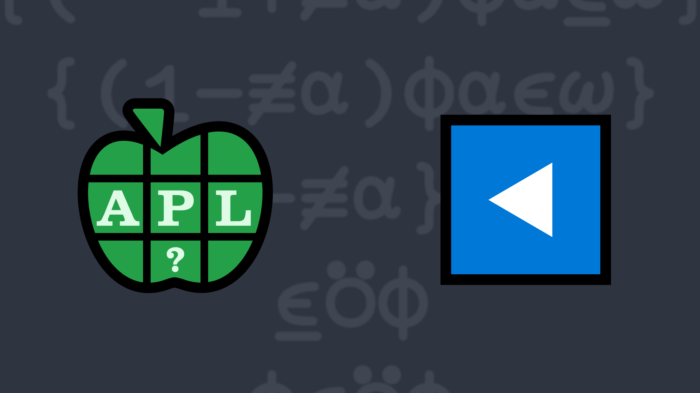

# 2023-2: Put It In Reverse
<!-- Write a function that takes takes a scalar or vector arguments and returns a Boolean result that is the same shape as the right argument where 1's mark the ends of occurrences of the left argument in the right argument. -->

The <em>find</em> function <a href="https://help.dyalog.com/latest/#Language/Primitive%20Functions/Find.htm" class="APL" target="_blank">X⍷Y</a> identifies the beginnings of occurrences of array X in array Y.

In this problem, you're asked to return a result that identifies the endings of occurrences of array X in array Y. To keep things simple, X and Y will be at most rank 1, meaning they'll either be vectors or scalars.

Write a function that:

<ul>
    <li>takes a scalar or vector left argument</li>
    <li>takes a scalar or vector right argument</li>
    <li>returns a Boolean result that is the same shape as the right argument where 1's mark the ends of occurrences of the left argument in the right argument</li>
</ul>

<i class="fas fa-lightbulb-on"></i> <strong>Hint:</strong> The <em>find</em> function <a href="https://help.dyalog.com/latest/#Language/Primitive%20Functions/Find.htm" class="APL" target="_blank">⍷</a> and <em>reverse</em> function <a href="https://help.dyalog.com/latest/#Language/Primitive%20Functions/Reverse.htm" class="APL" target="_blank">⌽</a> could be helpful in solving this problem.

<h5>Examples</h5>
<pre class="APL">
      'abra' (your_function) 'abracadabra'
0 0 0 1 0 0 0 0 0 0 1

      'issi' (your_function) 'Mississippi'
0 0 0 0 1 0 0 1 0 0 0

      'bb' (your_function) 'bbb bbb'
0 1 1 0 0 1 1
</pre><pre class="APL">
      (,42) (your_function) 42
0

      42 (your_function) 42
1

      (,42) (your_function) ,42
1
</pre><pre class="APL">
      'are' 'aquatic' (your_function) 'ducks' 'are' 'aquatic' 'avians' 
0 0 1 0
</pre>

  <code onclick="p_Input.focus()">your_function ← </code><input id="p_Input" autocomplete="off" spellcheck="false" oninput="this.parentElement.querySelector`button`.disabled=false;localStorage.setItem(window.location.pathname,this.value)" onkeypress="subm(event)">
  <button onclick="alert$.next`Testing…`;submitSolution`p`" class="md-button md-button--primary">&#x2714; Test</button>

<blockquote id="p_Output"></blockquote>
## Solutions

<time>5:58</time>

<a href="https://chat.stackexchange.com/transcript/52405?m=64977516#64977516" target="_blank" class="md-button md-button--primary">Chat transcript</a>
<a href="https://github.com/abrudz/apl_quest/tree/main/2023/2.apl" target="_blank" class="md-button md-button--primary right">Code on GitHub</a>

