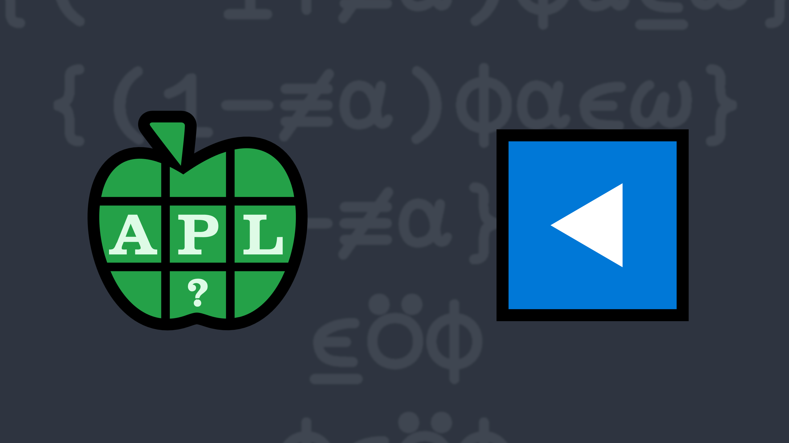

# 2: Put It In Reverse

The <em>find</em> function <a href="https://help.dyalog.com/latest/#Language/Primitive%20Functions/Find.htm" class="APL" target="_blank">X⍷Y</a> identifies the beginnings of occurrences of array X in array Y.

In this problem, you're asked to return a result that identifies the endings of occurrences of array X in array Y. To keep things simple, X and Y will be at most rank 1, meaning they'll either be vectors or scalars.

Write a function that:

<ul>
    <li>takes a scalar or vector left argument</li>
    <li>takes a scalar or vector right argument</li>
    <li>returns a Boolean result that is the same shape as the right argument where 1's mark the ends of occurrences of the left argument in the right argument</li>
</ul>

<i class="fas fa-lightbulb-on"></i> <strong>Hint:</strong> The <em>find</em> function <a href="https://help.dyalog.com/latest/#Language/Primitive%20Functions/Find.htm" class="APL" target="_blank">⍷</a> and <em>reverse</em> function <a href="https://help.dyalog.com/latest/#Language/Primitive%20Functions/Reverse.htm" class="APL" target="_blank">⌽</a> could be helpful in solving this problem.

<h5>Examples</h5>
<pre class="APL">
      'abra' (<i>your_function</i>) 'abracadabra'
0 0 0 1 0 0 0 0 0 0 1

      'issi' (<i>your_function</i>) 'Mississippi'
0 0 0 0 1 0 0 1 0 0 0

      'bb' (<i>your_function</i>) 'bbb bbb'
0 1 1 0 0 1 1
</pre><pre class="APL">
      (,42) (<i>your_function</i>) 42
0

      42 (<i>your_function</i>) 42
1

      (,42) (<i>your_function</i>) ,42
1
</pre><pre class="APL">
      'are' 'aquatic' (<i>your_function</i>) 'ducks' 'are' 'aquatic' 'avians' 
0 0 1 0
</pre>

  <code>your_function ← </code><input id="p_Input" autocomplete="off" spellcheck="false">
  <button onclick="alert$.next`Testing…`;submitSolution`p`" class="md-button">&#x2714; Test</button>

<blockquote id="p_Output"></blockquote>
??? info "Solutions"
    

        
        
    

    [Chat transcript](https://chat.stackexchange.com/transcript/52405?m=64977516#64977516) ∙ [Code on GitHub](https://github.com/abrudz/apl_quest/tree/main/2023/2.apl)

