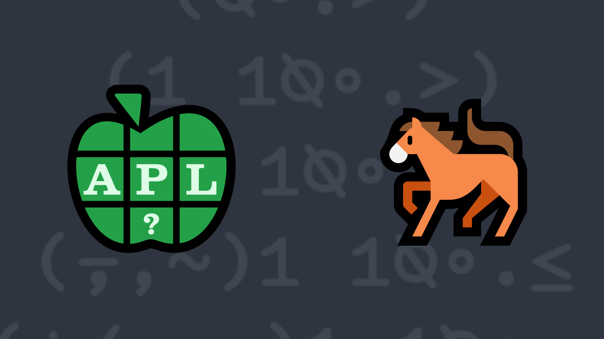

# 2023-5: Risky Business
<!-- Write a function that takes non-empty, descending integer vectors representing the attacker's and defender's dice rolls and returns a 2-element vector where the first element represents the number of armies the attacker lost and the second element represents the number of armies the defender lost. -->

The board game <a href="https://en.wikipedia.org/wiki/Risk_(game)">Risk</a> is a game of world domination where opposing players roll dice to determine the outcome of one player's armies attacking another's. The attacker can roll up to three 6-sided dice and the defender can roll up to two 6-sided dice. The resulting rolls are then individually compared from highest to lowest. If the attacker's die value is greater than the defender's, the defender loses one army. If the defender's die value is greater than or equal to the attacker's, the attacker loses one army. If one player rolls more dice than the other other player, the additional dice are not considered in the evaluation. For this problem, we'll generalize the task by allowing any number of dice for either the attacker or defender, and any integer values in the arguments.

Write a function that:

<ul>
<li>takes a non-empty, descending integer vector left argument representing the attacker's dice rolls</li>
<li>takes a non-empty, descending integer vector right argument representing the defender's dice rolls</li>
<li>returns a 2-element vector where the first element represents the number of armies the attacker lost and the second element represents the number of armies the defender lost.</li>
</ul>

<strong>Note:</strong> The left and right arguments do not need to be the same length.

<i class="fas fa-lightbulb-on"></i> <strong>Hint:</strong> The <em>less</em> function <a href="https://help.dyalog.com/latest/#Language/Primitive%20Functions/Less.htm" class="APL" target="_blank">&lt;</a> could be helpful in solving this problem.

### Examples:
<pre class="APL">      
      6 6 4 2 1 (your_function) 6 5 5 ⍝ attacker loses 2 armies, defender loses 1 army
2 1 

      6 (your_function) ⍥, 5 ⍝ ⍥, ravels both arguments (making them vectors) before passing them to your function
0 1

      4 0 ¯1  (your_function) 3 1 ¯2
1 2
</pre>

  <code onclick="p_Input.focus()">your_function ← </code><input id="p_Input" autocomplete="off" spellcheck="false" oninput="this.parentElement.querySelector`button`.disabled=false;localStorage.setItem(window.location.pathname,this.value)" onkeypress="subm(event)">
  <button onclick="alert$.next`Testing…`;submitSolution`p`" class="md-button md-button--primary">&#x2714; Test</button>

<blockquote id="p_Output"></blockquote>
## Solutions

<time>6:24</time>

<a href="https://chat.stackexchange.com/transcript/52405?m=65101517#65101517" target="_blank" class="md-button md-button--primary">Chat transcript</a>
<a href="https://github.com/abrudz/apl_quest/tree/main/2023/5.apl" target="_blank" class="md-button md-button--primary right">Code on GitHub</a>

