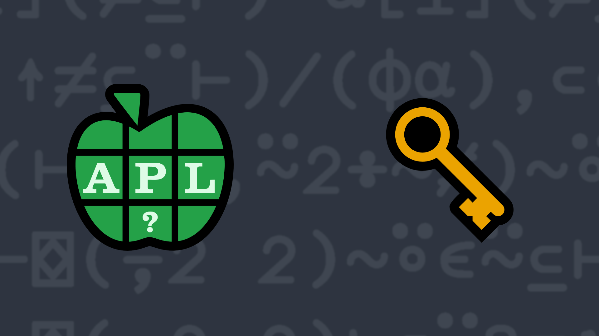

# 2023-6: Key/Value Pairs
<!-- write a function that takes a 2-element character vector left argument where the first element represents the separator character between multiple key/value pairs and the second element represents the separator between the key and the value for each pair and takes a character vector right argument representing a valid set of key/value pairs (delimited as specified by the left argument) and returns a 2-column matrix where the first column contains the character vector keys of the key/value pairs and the second column contains the character vector values. -->

Representing data as key/value pairs (also known as name/value pairs) is a very common technique. For example, it can be found in query strings in HTTP URIs, attribute settings in HTML elements, and in JSON objects. One common representation for a key/value pair is to have a character key (name) followed by an equals sign (=) followed by the value. Multiple key/value pairs can be separated by a delimiter character or characters. For example:

<pre class="APL">
      key1=value1;key2=value2
</pre>
 

Write a function that:

<ul>
  <li>takes a 2-element character vector left argument where the first element represents the separator character between multiple key/value pairs and the second element represents the separator between the key and the value for each pair.</li>
  <li>takes a character vector right argument representing a valid set of key/value pairs (delimited as specified by the left argument).</li>
  <li>returns a 2-column matrix where the first column contains the character vector keys of the key/value pairs and the second column contains the character vector values.</li>
</ul>

<strong>Note:</strong> You may assume that there will be no empty names or values in the right argument.
 

<i class="fas fa-lightbulb-on"></i> <strong>Hint:</strong> The <em>partition</em> function <a href="https://help.dyalog.com/latest/#Language/Primitive%20Functions/Partition.htm" class="APL" target="_blank">⊆</a> could be helpful in solving this problem.

<h5>Examples</h5>
<pre class="APL">      
      ⍴ ⎕← ' =' (your_function) 'language=APL dialect=Dyalog' 
┌────────┬──────┐
│language│APL   │
├────────┼──────┤
│dialect │Dyalog│
└────────┴──────┘
2 2      

      ⍴ ⎕← ';:' (your_function) 'duck:donald' 
┌────┬──────┐
│duck│donald│
└────┴──────┘
1 2      
 
      ⍴ ⎕← '/:' (your_function) 'name:Morten/name:Brian/name:Adám'
┌────┬──────┐
│name│Morten│
├────┼──────┤
│name│Brian │
├────┼──────┤
│name│Adám  │
└────┴──────┘
3 2
</pre>

  <code onclick="p_Input.focus()">your_function ← </code><input id="p_Input" autocomplete="off" spellcheck="false" oninput="this.parentElement.querySelector`button`.disabled=false;localStorage.setItem(window.location.pathname,this.value)" onkeypress="subm(event)">
  <button onclick="alert$.next`Testing…`;submitSolution`p`" class="md-button md-button--primary">&#x2714; Test</button>

<blockquote id="p_Output"></blockquote>
## Solutions

<a href="https://chat.stackexchange.com/transcript/52405?m=65151113#65151113" target="_blank" class="md-button md-button--primary">Chat transcript</a>
<a href="https://github.com/dyalog/apl.quest/tree/main/2023/6.apl" target="_blank" class="md-button md-button--primary right">Code on GitHub</a>

