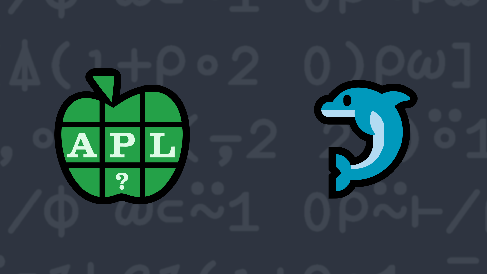

# 2023-9: Flipping Pairs
<!-- Write a function that takes a non-empty non-scalar array right argument and returns an array of the same shape as the argument, but with pairs of elements along the last axis "flipped". If the array has an odd number of elements in the last axis, leave the last element unchanged. -->
This problem has no practical use in the real world (that the author can think of) other than to give your array manipulation muscles some exercise.

Write a function that:

- takes a non-empty non-scalar array right argument
- returns an array of the same shape as the argument, but with pairs of elements along the last axis "flipped". If the array has an odd number of elements in the last axis, leave the last element unchanged.

<strong>Hint:</strong> Either the <em>reverse</em> function <a href="https://help.dyalog.com/latest/#Language/Primitive%20Functions/Reverse.htm" class="APL" target="_blank">⌽</a> used with the <em>partitioned enclose</em> function <a href="https://help.dyalog.com/latest/#Language/Primitive%20Functions/Partitioned%20Enclose.htm" class="APL" target="_blank">⊂</a>, or the <em>grade up</em> function <a class="APL" target="_blank" href="https://help.dyalog.com/latest/#Language/Primitive%20Functions/Grade%20Up%20Monadic.htm">⍋</a> used with the <em>index</em> function <a class="APL" target="_blank" href="https://help.dyalog.com/latest/#Language/Primitive%20Functions/Index.htm">⌷</a>, could be helpful in solving this problem.

### Examples:
<pre class="APL">
      (your_function) ⍳10
2 1 4 3 6 5 8 7 10 9

      (your_function) ⍳9
2 1 4 3 6 5 8 7 9

      (your_function) 4 2⍴⍳8
2 1
4 3
6 5
8 7

(your_function) 4 3⍴⍳12
 2  1  3
 5  4  6
 8  7  9
11 10 12

      (your_function) 3 3 3⍴⍳27
2  1  3
5  4  6
8  7  9
     
11 10 12
14 13 15
17 16 18
     
20 19 21
23 22 24
26 25 27

      (your_function) 2 3⍴'donald' 'duck' 'wrote' 'some' 'good' 'APL'
┌────┬──────┬─────┐
│duck│donald│wrote│
├────┼──────┼─────┤
│good│some  │APL  │
└────┴──────┴─────┘
</pre>

  <code onclick="p_Input.focus()">your_function ← </code><input id="p_Input" autocomplete="off" spellcheck="false" oninput="this.parentElement.querySelector`button`.disabled=false;localStorage.setItem(window.location.pathname,this.value)" onkeypress="subm(event)">
  <button onclick="alert$.next`Testing…`;submitSolution`p`" class="md-button md-button--primary">&#x2714; Test</button>

## Solutions

<time>24:47</time>

<a href="https://chat.stackexchange.com/transcript/52405?m=65274150#65274150" target="_blank" class="md-button md-button--primary">Chat transcript</a>
<a href="https://github.com/abrudz/apl_quest/tree/main/2023/9.apl" target="_blank" class="md-button md-button--primary right">Code on GitHub</a>

